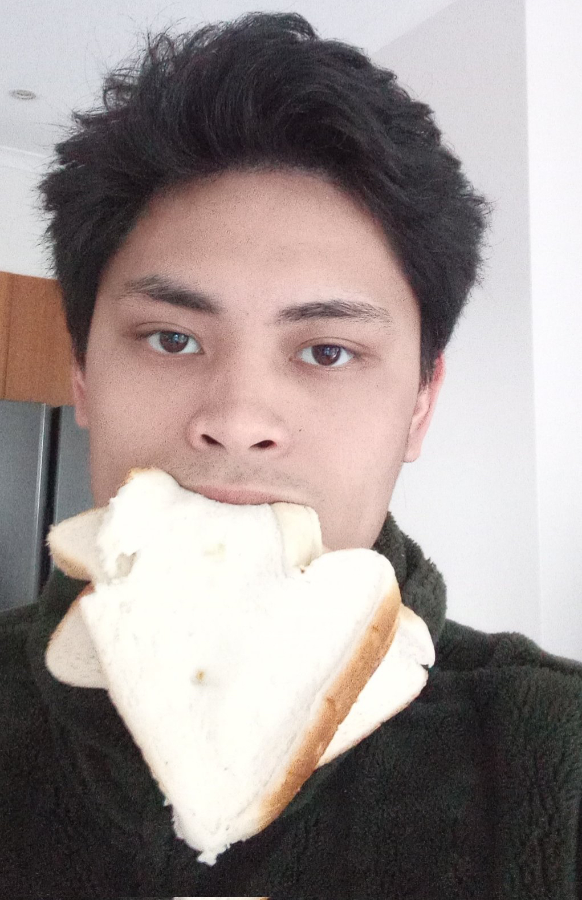

<!DOCTYPE html>
<html>
<body>

<h1>IIT Assignment 1: My Profile</h1>
<h2><u>Personal Information</u></h2>

<b>Name:</b> Sean Antonio Miguel Reyes De Chavez
 

<b>Student Number:</b> s3960496

<b>Student Email Address:</b> s3964096@student.rmit.edu.au

<b>GitHub Public Repository URL:</b> <a href="https://github.com/seandechavez/sdc.iit.assignment1.io"> Github Repository </a>

<b>GitHub Pages URL:</b> <a href="https://seandechavez.github.io/sdc.iit.assignment1.io/">Website</a>

<b>Basic Background Information:</b> 
I’m 22 years old and Buddhist, my family immigrated to Australia from the Philippines when I was 8 years old. I speak both Tagalog and English at home. After high school, I enrolled for a Bachelor of Social Sciences but I did not complete the degree due to life circumstances but I am ready now to go back to school and learn again. I’m a gamer and the games I currently play are League of Legends and Teamfight Tactics both by Riot Games although recently I’ve been spending less time gaming and more time studying. My hobbies other than gaming are exercising, yoga, reading and book club with my online friends.

<h2><u>Interest in IT</u></h2>

My interest in IT stems from being exposed to technology all my life from gaming as a little kid learning English through playing Pokémon and Final Fantasy, to witnessing the transformative power of IT in real time with social media cementing itself as an integral part of modern society and streaming services replacing Entertainment TV for the newer generations. My interest to go ahead and study IT sparked from watching a Game Dev streamer talk about and play the game they worked on so passionately and thinking to myself that I would like to do that one day. I have no real IT experience but I am very eager to learn more as the experience has been enjoyable thus far. I chose to study at RMIT because it is online and I love the flexibility that online learning gives me and the Bachelor of Information Technology degree entry requirements via OUA allows me to dip my toes in the water before fully committing to it. The IT umbrella is very diverse and I expect to learn a lot about anything that falls under the IT umbrella and hopefully decide and start an IT career path at the end of this journey.

<h2><u> <a href ="https://www.seek.com.au/job/57111686?type=standout#sol=e4dc9e6659cf8a0f943490d99fccb0c1514abdc1"> Ideal Job</a></u></h2>

My ideal job would be a video game programmer; this job appeals to me because I would love to work on a game one day and maybe make my own somewhere down the line and this job would allow me the privilege of working on multiple games and learning the skills required to make games.

The skills required for this job are proficiency in coding and coding languages such as C, C++ or C#, knowledgeable in a game discipline, be a team member with great verbal, written and interpersonal skills, excellent time management, able to familiarise quickly with codebases and other technical skills, love for games and the game industry 
The qualifications required are a 
‘Bachelor’s degree in Computer Science or equivalent experience, 
2 years’ professional software development experience, 
and experience interfacing with 3D art applications’ (Keywords Studios 2022).

The only requirements I meet currently are a love for games and the game industry and the ability to be a good team member with decent verbal, written and interpersonal skills which I’ve acquired through years of playing a game where teamwork and communication whether verbal or written is essential to a good game experience. 

To acquire the required skills and qualifications for the job I plan on finishing this unit and enrolling for the Bachelor of Information Technology degree then finishing the degree and hopefully getting a job in software development to get the experience necessary. I would also be taking game design related classes when possible to gain the knowledge needed to be able to work on games.

<h2><u>Personality Profile</u></h2>

<b>MBTI:</b>

 INFP-T 
 

<b>Learning Style:</b>

Visual/Tactile
 

<b>Big Five:</b>

 Openness – 94% 

 Conscientiousness – 15% 

 Extraversion – 10% 

 Agreeableness – 90% 

 Neuroticism – 54% 

My learning style results tell me that I learn best when it’s through a visual medium or through hands-on experience moreover, I know that when I’m learning something that is both of a visual and tactile nature I can understand and replicate it easily. My personality test results reinforce to me that I am a kind-hearted and open, highly empathetic understanding individual that wants the best for everyone and is constantly on a path of self-introspection and improvement but with all that comes a severely introverted and shy nature compounded by my own social anxiety.

I believe I would make a good group member because I offer a unique view on matters that considers everyone else’s wants and needs before my own and find solutions that are for the good of the team even if it’s at the cost of my own wants and needs. My introverted nature may have a negative effect on my behaviour in the group since it makes me naturally averse to group work but to counter that I’ve been practicing and warming up to group work via participating during lectures and tutorials.

When forming a team, I should consider people with more extroverted personalities to make me feel at ease with talking more so I can contribute as best as I can and other sympathetic/empathetic personalities to understand that my quiet and passiveness is not disinterest but deep thought and introspection.
 

<h2><u>Project Idea</u></h2>

<b><u>Overview</u></b>

Along with games I am also passionate about social justice and social media so my project idea is a social media app for gamers that doesn’t remain impartial in matters regarding social justice and the like while educating its users to be more socially conscious and aware to create safe spaces for queer gamers or gamers of colour and to create positive online communities for gamers in general.
 

<b><u>Motivation</u></b>

<b><u>Description</u></b>

<b><u>Tolls and Technologies</u></b>

<b><u>Skills Required</u></b>

<b><u>Outcome</u></b>

</body>
</html>
